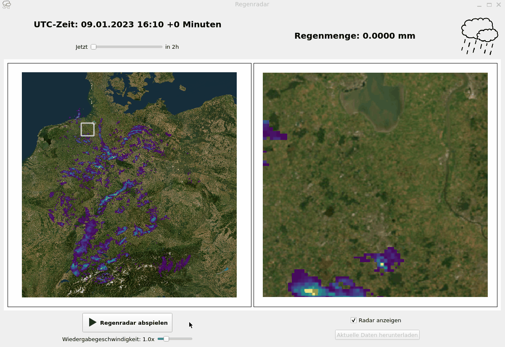

# Interaktives Regenradar (PyQt)

Diese PyQt-Applikation dient als Regenradar. Die App stellt eine Visualisierung von Regenradardaten in Form einer Karte bereit.

Standardmäßig wird ein Beispieldatensatz verwendet, der vorberechnet in Form einer komprimierten Numpy-Datei (.npz) vorliegt.

Das Laden eines Datensatzes ist aufwendig, weshalb ein paralleler Worker-Thread verwendet wird. Zudem wird eine Ladeanimation angezeigt.

Der zeitliche Verlauf der Regenwolken kann in einer Slideshow animiert werden, die durch einen Abspielbutton gestartet wird.

Zudem steht ein Slider bereit, der die exakte Auswahl eines Vorhersagezeitpunktes ermöglicht.

Die Darstellung der Radardaten kann mit einer Checkbox (de-)aktiviert und die Slideshowgeschwindigkeit mit einem Regler festgelegt werden.

Neben der Hauptansicht der Radardaten zeigt eine weitere Visualisierung eine herangezoomte Ansicht eines Kartenausschnittes, der mit einer Region of Interest (ROI) in der Hauptansicht festgelegt werden kann.

Das Zoomfenster kann durch das Verschieben der ROI, dem Verändern der Form der ROI oder dem Klicken auf eine beliebige Stelle der Karte festgelegt werden.

Wird der Mauszeiger im Zoomfenster bewegt, wird der jeweilige Regenwert angezeigt.

Aufgrund komplexer Dependencies wurden folgende Funktionen für die Demo deaktiviert:
- Automatisiertes Herunterladen des aktuellsten Datensatzes vom Deutschen Wetterdienst (DWD)
- Transformation und Berechnungen auf Grundlage der Originalbinärdateien

## Demo

## Sources

### Satellite data

Esri, Maxar, Earthstar Geographics, and the GIS User Community

Available at: https://services.arcgisonline.com/ArcGIS/rest/services/World_Imagery/MapServer

### Radar data
Deutscher Wetterdienst (DWD): RV Radarkomposit.

Available at: https://opendata.dwd.de/weather/radar/composite/rv/

License: Creative Commons BY 4.0 (CC BY 4.0)
